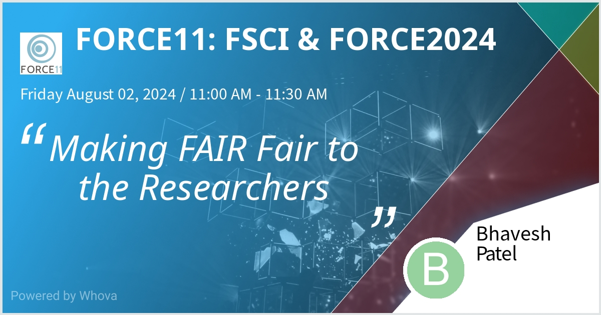

[![CC BY 4.0][cc-by-shield]][cc-by]

[cc-by]: http://creativecommons.org/licenses/by/4.0/
[cc-by-shield]: https://img.shields.io/badge/License-CC%20BY%204.0-lightgrey.svg
[cc-by-image]: https://i.creativecommons.org/l/by/4.0/88x31.png

# Repository of the material for FORCE11 Annual Conference - FORCE2024(August 1-3 2024)

## About

This repository contains the material and information associated with Bhavesh Patel's presentation at the FORCE11 Annual Conference - FORCE2024. He will be presenting about our lessons learned for making FAIR fair to the researchers.

## Schedule

| Type            | Date & Time             | Authors                          | Session / Location                                              | Details |
| --------------- | -----------------|--------------------------------- |------------------------------------------------------ |------------------- |
| Talk      |  Friday, August 2, 2024, at 11:00 am PDT | Bhavesh Patel (presenter)|  Young Research Library - Main Conference Room | https://force11.org/conference/post/force2024-schedule/

  
   
  </img>

## Meeting material
- [FAIRfair-FORCE2024-Patel.pdf](FAIRfair-FORCE2024-Patel.pdf): slides of the talk
- Also available on Zenodo: https://doir.org/10.5281/zenodo.13159874

## Resources

We list here major resources relevant to the talk.

| Description                                         | Link                                                              |
| --------------------------------------------------  | ----------------------------------------------------------------- |
| Downloading SODA                             | https://docs.sodaforsparc.io/docs/getting-started/download-soda |
| High-level information about SODA                             | https://docs.sodaforsparc.io/docs/intro  |
| Repository of SODA             | https://github.com/fairdataihub/SODA-for-SPARC|
| SODA documentation  | https://docs.sodaforsparc.io |
| SPARC data curation and sharing guidelines  | https://docs.sparc.science/docs/data-submission-walkthrough |
| FAIR-BioRS guidelines                           | https://fair-biors.org/ |
| FAIR-BioRS guidelines manuscript                          | https://doi.org/10.1038/s41597-023-02463-x |
| FAIR4RS principles                          | https://doi.org/10.15497/RDA00068 |
| Everything related to codefair                         | https://codefair.io |
| Codefair on the GitHub marketplace                         | https://github.com/marketplace/codefair-app |

## License
The material in this repository is licensed under a
[Creative Commons Attribution 4.0 International License][cc-by].

[![CC BY 4.0][cc-by-image]][cc-by]

## Contact us
For submitting feedback or getting in touch either:
- Use the [GitHub issues](https://github.com/fairdataihub/FAIRfair-FORCE2024/issues) 
- Email us: bpatel@calmi2.org

